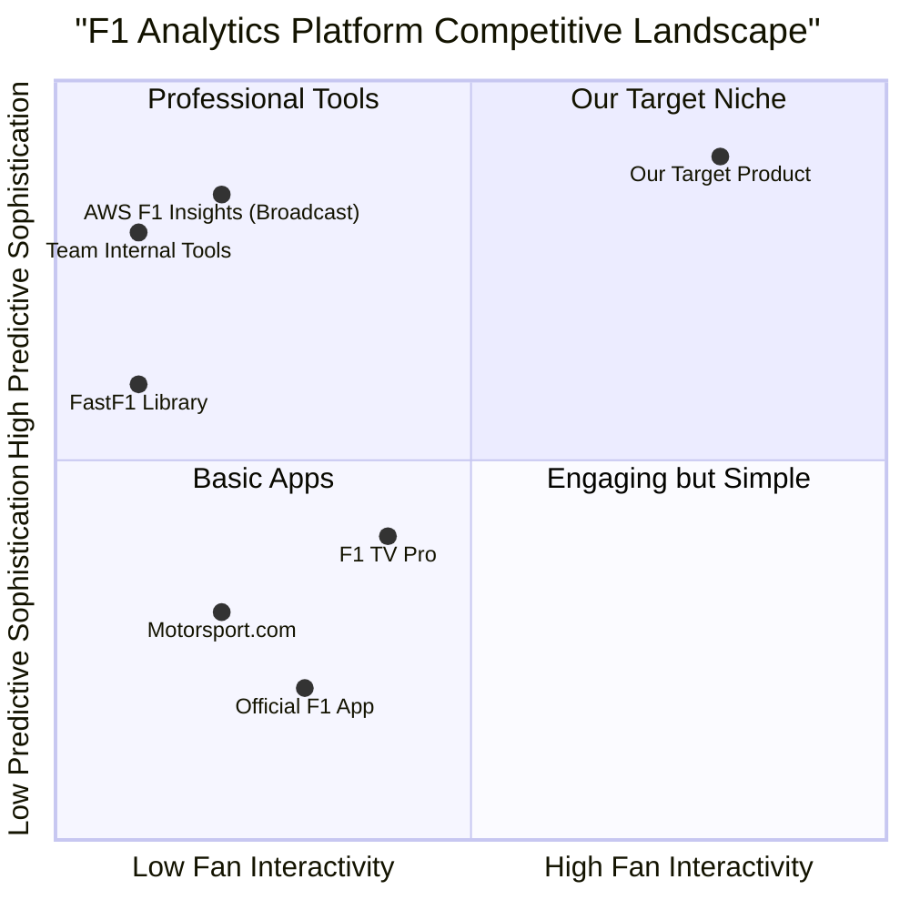

# Product Requirements Document: F1 Fan Analytics & Prediction Platform

- **Version**: 1.0
- **Date**: 2025-11-06
- **Author**: Emma, Product Manager
- **Status**: Draft 1.0

---

## 1. Introduction

### 1.1. Project Name
f1_fan_analytics_and_prediction_app

### 1.2. Original Requirements
The user envisions a "never seen before" F1 Analytics and Prediction application designed for F1 fans and enthusiasts. The core goal is to provide a single, comprehensive window for fans to experiment with race strategies, view accurate predictions for all race events (qualifying, sprint, main race), and engage with the sport on a deeper level.

Key requirements include:
- A platform that is date-aware, season-aware, and self-improvises its models after each race weekend to improve accuracy.
- The ability for users to monitor favorite drivers, compare performances, and experiment with strategies.
- Live, lap-by-lap predictions during races.
- A conversational "F1 enthusiast friend" AI agent that can answer questions, explain outcomes, and make predictions.
- A balanced application of Generative AI with traditional and advanced ML techniques.
- Live statistics such as driver/constructor standings and championship probabilities.
- Utilization of track layouts for analysis and predictions.
- The final output must be a fully functional application with no stubs or mocks.

### 1.3. Programming Language & Framework
- **Framework**: Next.js
- **Language**: TypeScript
- **UI**: Shadcn-ui, Tailwind CSS

## 2. Product Definition

### 2.1. Product Goals
The platform's success will be measured by its ability to achieve three primary, orthogonal goals:

1.  **Empower Fans**: To provide fans with powerful, interactive tools that demystify the complexities of F1. Users must be able to experiment with race strategies and explore "what-if" scenarios, transforming passive viewing into an active, engaging experience.
2.  **Deliver Unparalleled Insight**: To offer highly accurate, real-time predictions and a conversational AI assistant that makes complex data accessible and engaging. The platform must become the go-to source for trustworthy, data-driven F1 insights.
3.  **Create a Living Platform**: To develop a self-improving system that learns from every lap of every race. This ensures that the platform's predictive models become more accurate and relevant over time, building long-term user trust and value.

### 2.2. User Stories

- **As a dedicated F1 enthusiast, I want to** simulate alternative pit stop strategies for my favorite driver during a live race, **so that I can** see how their race could have unfolded differently and debate the team's decisions with my friends.
- **As a casual fan, I want to** ask a friendly AI assistant, "Why did they pit Leclerc now?" and get a simple, clear explanation, **so that I can** better understand the strategic nuances of the sport without feeling overwhelmed.
- **As a fantasy league player, I want to** see live, lap-by-lap predictions for driver finishing positions and key battles, **so that I can** track my fantasy team's performance and potential points in real-time.
- **As a new fan, I want** a single dashboard that shows me the current driver standings, constructor standings, and the predicted winner for the upcoming race, **so I can** quickly get up to speed before the race weekend.

### 2.3. Competitive Analysis

| Product/Service | Pros | Cons |
| :--- | :--- | :--- |
| **F1 TV Pro** | Official live streaming, access to basic timing data and telemetry. | No predictive analytics, no interactive strategy tools, limited data visualization. |
| **AWS F1 Insights (Broadcast)** | Highly sophisticated, ML-powered insights shown to millions. | Not interactive or user-controlled. A "black box" with no access for fans to explore. |
| **FastF1 (Python Library)** | Provides deep, programmatic access to historical and session data. | Requires coding skills. It's a tool for developers, not a user-facing application. |
| **Motorsport.com / The Race** | Excellent expert analysis, articles, and news coverage. | Not real-time, not interactive, not personalized. Insights are static. |
| **Official F1 App** | Good for live leaderboards, news, and basic race information. | Lacks deep analytics, predictions, or any form of strategy simulation tools. |
| **Various Betting Sites** | Provide odds (a form of prediction). | Singular focus on betting, lacks strategic context, explanations, or fan engagement features. |
| **SofaScore / FotMob** | Excellent real-time stats UI and notifications for other sports. | Not specialized for F1's unique strategic depth (tires, pit stops, etc.). |

### 2.4. Competitive Quadrant Chart

Our product aims to occupy a unique space in the market, combining the predictive sophistication of professional tools with the accessibility and interactivity that fan-facing platforms currently lack.

## 3. Technical Specifications

### 3.1. Requirements Analysis
The application requires a multi-layered, cloud-native architecture designed for real-time data processing, machine learning, and a highly dynamic user experience.

- **Data Ingestion**: The system must be capable of ingesting data from multiple sources, including the FastF1 library for session data and potentially other real-time APIs. The architecture must be robust to handle data delays and inconsistencies.
- **Real-Time Processing**: An event-driven architecture using a streaming platform (like Kafka or AWS Kinesis) is essential to process millions of data points, calculate live predictions, and update the user interface with minimal latency.
- **Machine Learning (ML) Core**: The platform will feature a dual-ML core:
    1.  **Predictive ML**: A suite of traditional and advanced models (LSTMs, XGBoost, Reinforcement Learning) for lap times, overtakes, tire degradation, and strategy optimization.
    2.  **Generative AI (GenAI)**: A Large Language Model (LLM) integrated to power the conversational AI assistant, providing natural language explanations and insights.
- **MLOps Pipeline**: To fulfill the "self-improvising" requirement, a robust MLOps pipeline is critical. This includes automated data validation, model retraining after each race, performance monitoring, and deployment, ensuring the models continuously learn and improve.
- **Backend & Frontend**: A decoupled architecture with a backend providing data via APIs (REST/GraphQL) to a dynamic frontend built with Next.js, TypeScript, and Shadcn-ui for a modern, responsive user experience.

### 3.2. Requirements Pool (Prioritized)

#### P0: Must-Have (Core Viable Product)
These features are essential for the initial launch to meet the user's core vision.

| ID | Requirement | User Value |
| :--- | :--- | :--- |
| **FEAT-001** | **User Account & Profile** | Allows users to personalize their experience by selecting a favorite driver and team. |
| **FEAT-002** | **Main Dashboard** | Provides an at-a-glance view of Driver/Constructor standings and pre-race predictions. |
| **FEAT-003** | **Conversational AI Assistant** | The "F1 Friend". Answers user questions, explains race events, and provides simple predictions in natural language. |
| **FEAT-004** | **Post-Race Strategy Simulator** | An interactive tool to analyze completed races, allowing users to explore "what-if" pit strategies. |
| **FEAT-005** | **Live Race View** | A dedicated screen for live races showing a real-time leaderboard, a feed of key events, and live-updating standings. |
| **FEAT-006** | **Season & Date Awareness** | The application must correctly reflect the current F1 season, upcoming race, and relevant historical context. |

#### P1: Should-Have (High-Value Enhancements)
These features build upon the core product to create a truly "never seen before" experience.

| ID | Requirement | User Value |
| :--- | :--- | :--- |
| **FEAT-007** | **Live Lap-by-Lap Predictions** | Integrates real-time predictive models into the Live Race View (e.g., overtake probability, final position forecast). |
| **FEAT-008** | **Live Strategy Simulator** | Enhances the simulator to allow "what-if" scenarios *during* a live race, with outcomes based on real-time data. |
| **FEAT-009** | **Automated Model Retraining** | Implements the MLOps pipeline to automatically retrain and deploy models after each race, fulfilling the "self-improvising" goal. |
| **FEAT-010** | **Head-to-Head Driver Comparison** | A dedicated feature to compare two drivers based on key performance metrics across a season. |
| **FEAT-011** | **Track Layout Visualizations** | Integrates interactive track maps showing corner analysis, DRS zones, and where time is gained or lost. |

#### P2: Nice-to-Have (Future Growth)
These features can be developed post-launch to further enhance user engagement and retention.

| ID | Requirement | User Value |
| :--- | :--- | :--- |
| **FEAT-012** | **User Prediction Leagues** | Gamifies the experience by allowing users to compete with friends by making predictions. |
| **FEAT-013** | **Detailed Telemetry View** | An "expert mode" for enthusiasts to view raw telemetry traces like speed, throttle, and brake. |
| **FEAT-014** | **Custom Push Notifications** | Allows users to set up alerts for major race events, battles involving their favorite driver, or significant prediction changes. |
| **FEAT-015** | **Multi-Language Support** | Expands the user base by offering the UI and AI Assistant in multiple languages. |

### 3.3. UI Design Draft

-   **Main Dashboard**: A clean, widget-based layout. Key widgets will include:
    -   "Upcoming Race": A countdown timer, circuit name, and predicted podium.
    -   "Driver Standings": Top 5 drivers with points.
    -   "Constructor Standings": Top 3 constructors with points.
    -   A prominent, persistent entry point to the "AI Assistant".
-   **Live Race View**: This will be the most dynamic screen.
    -   **Main Panel (70% width)**: An interactive track map showing the real-time position of all cars.
    -   **Side Panel (30% width)**: A tabbed interface containing:
        -   *Leaderboard*: A scrollable list of all drivers, their positions, gaps, and current tire compound.
        -   *Event Feed*: A real-time log of overtakes, pit stops, flags, and AI-generated insights.
        -   *Live Predictions*: A dedicated panel for dynamic predictions like "Battle Forecast" and "Championship Points Live".
-   **Strategy Sandbox**:
    -   A visual timeline of a selected race (either completed or in-progress).
    -   The timeline will show actual pit stops. Users can add/move/delete pit stops and change tire compounds.
    -   A results panel will instantly update to show the simulated outcome (e.g., "If you pitted now, you would emerge in P8, 5s behind RIC").
-   **AI Assistant**:
    -   A full-screen, clean chat interface.
    -   The chat history will be preserved.
    -   Suggested prompt buttons will guide users (e.g., "Explain tire degradation," "Who is the favorite for Monza?").

### 3.4. Open Questions
1.  **Data Source for Live Telemetry**: What is the definitive source for live, sub-lap telemetry data? Is a commercial license (e.g., from F1) an option, or will we rely solely on APIs like FastF1, which may have a slight delay? The feasibility of true lap-by-lap predictions depends on this.
2.  **GenAI Budget**: What is the initial budget for GenAI API calls (e.g., OpenAI, Anthropic)? This will directly influence the capabilities, response time, and potential rate-limiting of the AI Assistant.
3.  **Performance Targets**: What are the initial targets for prediction accuracy? (e.g., Race winner prediction > 40% accuracy, pit window prediction +/- 2 laps).
4.  **Scope of "Full Application"**: The user requested a "full working final application." For initial delivery, does this mean a web-only application, or are mobile apps (iOS/Android) also part of the immediate scope? This PRD assumes a web-first approach.
5.  **Backend Infrastructure**: The research mentions AWS extensively. Is the team mandated to use AWS, or are other cloud providers (GCP, Azure) an option?