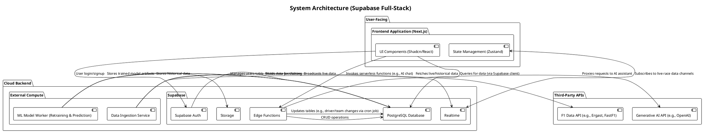
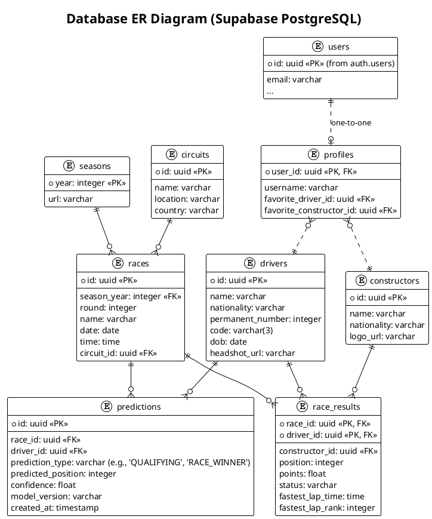
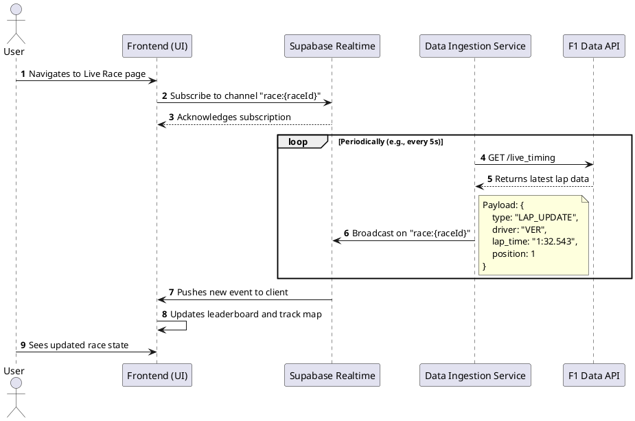

# System Design: F1 Fan Analytics & Prediction Platform

- **Version**: 2.0
- **Date**: 2025-11-06
- **Author**: Bob, Architect

---

## 1. Implementation Approach

This document outlines a full-stack architecture for the F1 Analytics and Prediction Platform, pivoting from a client-side proof-of-concept to a robust, scalable, and real-time application. The backend will be powered by **Supabase**, providing database, authentication, storage, and serverless capabilities.

This approach directly addresses the user's requirement for a "real" application with no mockups, supporting advanced features like live predictions, automated data updates, and machine learning model integration.

The implementation will be structured as follows:

1.  **Backend Setup**: Configure the Supabase project, including the PostgreSQL database schema, authentication rules (RLS), and storage buckets.
2.  **Data Ingestion**: Develop a standalone service to fetch historical and live data from the Ergast/FastF1 API and populate the Supabase database. This service will also feed the Supabase Realtime service during live events.
3.  **Backend Logic (Edge Functions)**:
    *   Create an Edge Function to act as a secure proxy for the conversational AI assistant, protecting API keys.
    *   Implement a scheduled Edge Function (`pg_cron`) to act as the "Agent," periodically checking for and applying updates to drivers, teams, and schedules.
4.  **Machine Learning Worker**: Develop an external service (e.g., running on a schedule in a separate compute environment) responsible for:
    *   Fetching training data from the Supabase DB.
    *   Retraining predictive models after each race.
    *   Storing updated model artifacts in Supabase Storage and writing new predictions to the `predictions` table.
5.  **Frontend Integration**: The Next.js frontend will communicate with Supabase using the `supabase-js` client library to handle user authentication, data queries, and real-time subscriptions.

## 2. Architecture

The system is decoupled into a frontend, a Supabase backend, external compute services for specialized tasks (data ingestion, ML), and third-party APIs.

## 3. Database ER Diagram

The database schema is designed to be relational and normalized, providing a single source of truth for all application data.

## 4. Program Call Flow (Live Race Experience)

This sequence diagram illustrates how real-time data flows through the system to the user during a live race.

## 5. Anything UNCLEAR / Assumptions

-   **Live Data Source**: The quality and latency of the "Live Race Experience" are entirely dependent on the third-party F1 Data API. We assume a reliable API (like FastF1's wrapper) is available, but its real-world performance will need to be validated.
-   **ML Worker Infrastructure**: The design of the ML Worker is high-level. The specific infrastructure (e.g., AWS SageMaker, Google AI Platform, a custom Docker container) and associated costs need to be defined in a separate, more detailed Data Science design document.
-   **Cost Management**: This architecture introduces new costs: Supabase plan, compute for ingestion/ML services, and GenAI API calls. These will need to be monitored and optimized.
-   **Logging and Monitoring**: A proper logging and monitoring solution (e.g., Supabase's built-in logs, or integrating with a service like Sentry or Datadog) must be implemented for all backend services to ensure reliability, especially for the "Agent" and ML worker.