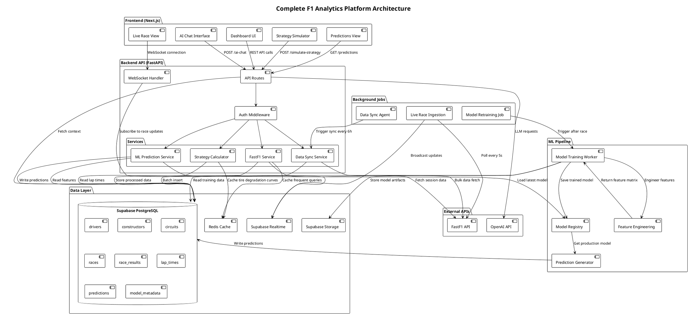
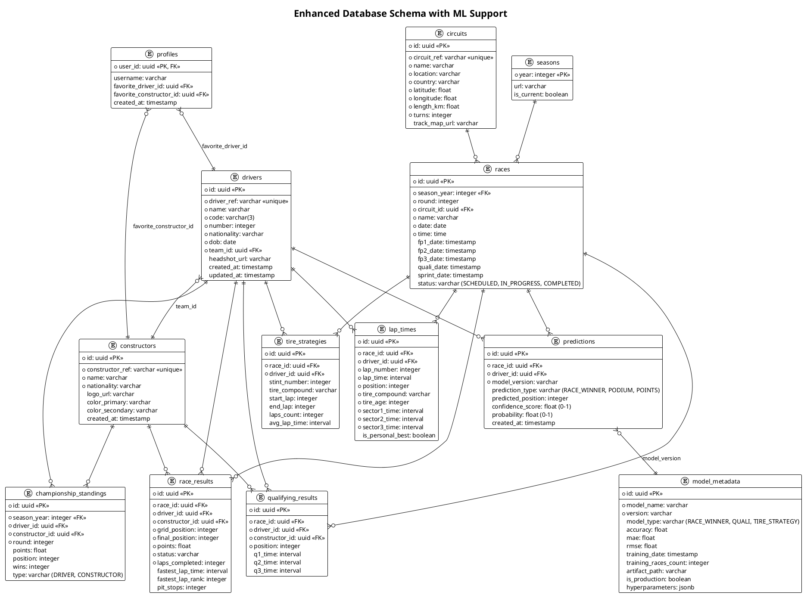

# System Design v3.0: F1 Fan Analytics & Prediction Platform
## Complete Production Implementation with FastF1 & ML

- **Version**: 3.0
- **Date**: 2025-11-07
- **Author**: Bob, Architect
- **Status**: Complete Redesign for Production

---

## 1. Implementation Approach

This is a **complete redesign** addressing critical gaps in the current implementation:

### Current Problems Identified:
1. ❌ No real ML predictions - just static UI
2. ❌ Dashboard shows perpetual "loading" states
3. ❌ No automatic data synchronization
4. ❌ Strategy Simulator non-functional
5. ❌ Predictions tab empty
6. ❌ Driver/Constructor standings not loading
7. ❌ No FastF1 integration despite requirements

### New Implementation Strategy:

**Phase 1: Backend Foundation (FastAPI + FastF1)**
- Build a **FastAPI backend** with FastF1 library for real F1 data
- Implement automatic data synchronization on startup
- Create ML prediction pipeline with actual models
- Set up Supabase for persistence and real-time features

**Phase 2: ML Core Implementation**
- Race winner prediction using XGBoost
- Qualifying position prediction
- Tire strategy optimization using historical degradation data
- Pit stop window prediction
- Championship probability calculator

**Phase 3: Frontend Integration**
- Connect all UI components to real backend APIs
- Implement real-time data updates during races
- Build functional Strategy Simulator with actual calculations
- Create interactive Predictions dashboard with confidence scores

**Phase 4: Agent & Automation**
- Background worker for automatic data sync (every 6 hours)
- Post-race model retraining pipeline
- Real-time race data ingestion during live events

### Technology Stack:

**Backend:**
- **FastAPI** (Python 3.11+) - High-performance async API
- **FastF1** - Official F1 data library with telemetry
- **Supabase** - PostgreSQL database, Auth, Storage, Realtime
- **Scikit-learn** - ML preprocessing and evaluation
- **XGBoost/LightGBM** - Gradient boosting models
- **Pandas/NumPy** - Data manipulation
- **APScheduler** - Background job scheduling
- **Redis** - Caching for performance

**Frontend:**
- **Next.js 14** with App Router
- **TypeScript**
- **Shadcn-ui + Tailwind CSS**
- **Recharts** - Data visualizations
- **TanStack Query** - Server state management
- **Supabase JS Client** - Real-time subscriptions

**ML Pipeline:**
- **MLflow** - Model versioning and tracking
- **Joblib** - Model serialization
- **SHAP** - Model explainability

---

## 2. Architecture



---

## 3. Database Schema (Enhanced)



---

## 4. API Endpoints Specification

### 4.1 Data Synchronization
```
POST /api/v1/sync/initialize
- Trigger full data sync (drivers, constructors, circuits, seasons, races)
- Returns: { status: "syncing", estimated_time: "5 minutes" }

POST /api/v1/sync/race/{race_id}
- Sync specific race results and lap times
- Returns: { race_id, laps_synced, results_synced }

GET /api/v1/sync/status
- Check current sync status
- Returns: { is_syncing, progress, last_sync }
```

### 4.2 Race Data
```
GET /api/v1/races/current
- Get current/next race information
- Returns: Race object with circuit, date, weather

GET /api/v1/races/{race_id}/results
- Get race results with lap times
- Returns: Array of results with driver, constructor, position

GET /api/v1/races/{race_id}/live
- WebSocket endpoint for live race updates
- Streams: lap times, positions, pit stops, incidents
```

### 4.3 Predictions
```
GET /api/v1/predictions/race/{race_id}
- Get ML predictions for upcoming race
- Returns: Array of predictions with confidence scores

POST /api/v1/predictions/generate/{race_id}
- Trigger prediction generation for race
- Returns: { job_id, status: "processing" }

GET /api/v1/predictions/accuracy
- Get historical prediction accuracy metrics
- Returns: { overall_accuracy, by_circuit, by_driver }
```

### 4.4 Strategy Simulator
```
POST /api/v1/strategy/simulate
Body: {
  race_id: uuid,
  driver_id: uuid,
  pit_stops: [{ lap: 15, tire: "SOFT" }, { lap: 35, tire: "MEDIUM" }],
  weather_scenario: "DRY" | "WET"
}
- Simulate alternative pit strategies
- Returns: {
    original_position: 5,
    simulated_position: 3,
    time_gained: 12.5,
    lap_by_lap: [...]
  }
```

### 4.5 Analytics
```
GET /api/v1/analytics/driver/{driver_id}/performance
- Get driver performance metrics across season
- Returns: { avg_position, points_per_race, qualifying_avg, ... }

GET /api/v1/analytics/circuit/{circuit_id}/insights
- Get circuit-specific insights and historical data
- Returns: { fastest_lap_record, avg_pit_stops, tire_wear_rate, ... }

GET /api/v1/standings/drivers
GET /api/v1/standings/constructors
- Get current championship standings
- Returns: Ordered array with points, wins, positions
```

### 4.6 AI Assistant
```
POST /api/v1/ai/chat
Body: {
  message: "Why did Hamilton pit on lap 25?",
  context: { race_id, driver_id }
}
- Chat with AI assistant about F1
- Returns: { response, sources: [...] }
```

---

## 5. ML Model Implementation Details

### 5.1 Race Winner Prediction Model

**Algorithm:** XGBoost Classifier

**Features (30+ engineered features):**
```python
# Driver Performance Features
- driver_avg_position_last_5_races
- driver_avg_points_last_5_races
- driver_qualifying_avg_season
- driver_dnf_rate_season
- driver_wins_season
- driver_podiums_season

# Circuit-Specific Features
- driver_avg_position_at_circuit (historical)
- driver_best_finish_at_circuit
- driver_laps_completed_at_circuit_pct

# Constructor Features
- constructor_avg_position_last_5_races
- constructor_points_per_race_season
- constructor_reliability_score

# Qualifying Features
- qualifying_position (P1-P20)
- qualifying_gap_to_pole (seconds)
- qualifying_sector_times_rank

# Championship Context
- driver_championship_position
- driver_points_gap_to_leader
- constructor_championship_position

# Weather & Track Conditions
- expected_temperature
- expected_rain_probability
- track_grip_level

# Tire Strategy Prediction
- predicted_pit_stops
- predicted_tire_compounds
```

**Training Process:**
1. Fetch last 3 seasons of race data from DB
2. Engineer features using pandas/numpy
3. Split: 80% train, 20% validation
4. Hyperparameter tuning with cross-validation
5. Train final model on all data
6. Evaluate on hold-out set (last 5 races)
7. Save model to Supabase Storage
8. Update `model_metadata` table

**Prediction Output:**
```json
{
  "race_id": "uuid",
  "predictions": [
    {
      "driver_id": "uuid",
      "driver_name": "Max Verstappen",
      "predicted_position": 1,
      "win_probability": 0.68,
      "podium_probability": 0.92,
      "points_probability": 0.98,
      "confidence_score": 0.85
    }
  ],
  "model_version": "v2.3.1",
  "generated_at": "2025-11-07T10:30:00Z"
}
```

### 5.2 Tire Strategy Optimization

**Algorithm:** Multi-objective optimization with constraints

**Approach:**
1. Build tire degradation model per compound per circuit using historical lap times
2. Model lap time as: `base_time + (tire_age * degradation_rate) + fuel_effect`
3. Use dynamic programming to find optimal pit windows
4. Constraints:
   - Minimum 1 pit stop (must use 2 compounds)
   - Pit stop time loss: ~23 seconds
   - Track position considerations

**Implementation:**
```python
def optimize_strategy(race_id, driver_id, weather="DRY"):
    # Load historical tire data for circuit
    tire_data = get_tire_degradation_curves(circuit_id)
    
    # Simulate all possible strategies
    strategies = []
    for pit_lap in range(10, 60):
        for compound1, compound2 in tire_combinations:
            result = simulate_race(
                pit_lap=pit_lap,
                compounds=[compound1, compound2],
                tire_data=tire_data
            )
            strategies.append(result)
    
    # Return top 5 strategies ranked by final position
    return sorted(strategies, key=lambda x: x['final_position'])[:5]
```

### 5.3 Qualifying Position Prediction

**Algorithm:** Gradient Boosting Regressor (LightGBM)

**Features:**
- FP3 best lap time
- FP3 long run pace
- Historical qualifying performance at circuit
- Constructor performance trend
- Weather conditions

**Output:** Predicted qualifying position (1-20) with MAE target < 2.5 positions

---

## 6. Data Synchronization Agent

### 6.1 Automatic Sync on Startup

**Implementation:**
```python
@app.on_event("startup")
async def startup_sync():
    """Initialize data on application startup"""
    sync_status = await check_last_sync()
    
    if sync_status['needs_sync']:
        logger.info("Starting automatic data synchronization...")
        
        # Sync in background to not block startup
        asyncio.create_task(full_data_sync())
```

### 6.2 Scheduled Background Sync

**Schedule:**
- Every 6 hours: Check for driver/constructor changes
- Every day at 00:00 UTC: Sync race calendar updates
- After each race (detected via race status): Sync results and retrain models

**Implementation using APScheduler:**
```python
from apscheduler.schedulers.asyncio import AsyncIOScheduler

scheduler = AsyncIOScheduler()

@scheduler.scheduled_job('interval', hours=6)
async def sync_driver_changes():
    """Check for driver lineup changes"""
    await sync_service.update_drivers()
    await sync_service.update_constructors()

@scheduler.scheduled_job('cron', hour=0, minute=0)
async def sync_race_calendar():
    """Update race schedule"""
    await sync_service.update_races()

@scheduler.scheduled_job('cron', hour=2, minute=0, day_of_week='sun')
async def post_race_pipeline():
    """Run after Sunday races"""
    latest_race = await get_latest_completed_race()
    
    # Sync race results
    await sync_service.sync_race_results(latest_race.id)
    
    # Trigger model retraining
    await ml_service.retrain_models()
    
    # Generate predictions for next race
    next_race = await get_next_race()
    await ml_service.generate_predictions(next_race.id)
```

---

## 7. Frontend Integration Architecture

### 7.1 Data Fetching Strategy

**Use TanStack Query for all API calls:**
```typescript
// hooks/useRaceData.ts
export function useCurrentRace() {
  return useQuery({
    queryKey: ['race', 'current'],
    queryFn: () => api.get('/races/current'),
    staleTime: 5 * 60 * 1000, // 5 minutes
    refetchInterval: 60 * 1000, // Refetch every minute
  });
}

export function useRaceResults(raceId: string) {
  return useQuery({
    queryKey: ['race', raceId, 'results'],
    queryFn: () => api.get(`/races/${raceId}/results`),
    enabled: !!raceId,
  });
}

export function useDriverStandings() {
  return useQuery({
    queryKey: ['standings', 'drivers'],
    queryFn: () => api.get('/standings/drivers'),
    staleTime: 10 * 60 * 1000,
  });
}
```

### 7.2 Real-time Updates

**WebSocket connection for live races:**
```typescript
// hooks/useLiveRace.ts
export function useLiveRace(raceId: string) {
  const [liveData, setLiveData] = useState<LiveRaceData | null>(null);
  
  useEffect(() => {
    const ws = new WebSocket(`wss://api.f1analytics.com/races/${raceId}/live`);
    
    ws.onmessage = (event) => {
      const update = JSON.parse(event.data);
      setLiveData(prev => updateRaceState(prev, update));
    };
    
    return () => ws.close();
  }, [raceId]);
  
  return liveData;
}
```

### 7.3 Dashboard Components

**Updated Dashboard.tsx:**
```typescript
export function Dashboard() {
  const { data: currentRace, isLoading: raceLoading } = useCurrentRace();
  const { data: driverStandings, isLoading: standingsLoading } = useDriverStandings();
  const { data: predictions } = useRacePredictions(currentRace?.id);
  
  if (raceLoading || standingsLoading) {
    return <LoadingSpinner />;
  }
  
  return (
    <div className="grid grid-cols-12 gap-4">
      <NextRaceCard race={currentRace} predictions={predictions} />
      <DriverStandingsWidget standings={driverStandings} />
      <ConstructorStandingsWidget />
      <RecentRaceResults />
    </div>
  );
}
```

---

## 8. Strategy Simulator Implementation

### 8.1 Backend Calculator

```python
class StrategySimulator:
    def __init__(self, race_id: str, driver_id: str):
        self.race = get_race(race_id)
        self.driver = get_driver(driver_id)
        self.circuit = self.race.circuit
        self.tire_data = load_tire_degradation_model(self.circuit.id)
    
    def simulate(self, strategy: Strategy) -> SimulationResult:
        """
        Simulate a race with given pit strategy
        
        Args:
            strategy: PitStop schedule with tire compounds
            
        Returns:
            SimulationResult with lap-by-lap positions and final result
        """
        current_position = self.driver.grid_position
        current_lap = 1
        tire_age = 0
        current_compound = strategy.starting_compound
        
        lap_by_lap = []
        
        for lap in range(1, self.race.total_laps + 1):
            # Calculate lap time based on tire age and compound
            base_time = self.get_base_lap_time()
            tire_degradation = self.tire_data[current_compound][tire_age]
            fuel_effect = self.calculate_fuel_effect(lap)
            
            lap_time = base_time + tire_degradation + fuel_effect
            
            # Check if pit stop scheduled
            if lap in strategy.pit_laps:
                lap_time += 23.0  # Pit stop time loss
                current_compound = strategy.get_compound_for_stint(lap)
                tire_age = 0
            
            # Update position based on lap time vs competitors
            current_position = self.calculate_position(lap_time, lap)
            
            lap_by_lap.append({
                'lap': lap,
                'position': current_position,
                'lap_time': lap_time,
                'tire_compound': current_compound,
                'tire_age': tire_age
            })
            
            tire_age += 1
        
        return SimulationResult(
            final_position=current_position,
            lap_by_lap=lap_by_lap,
            total_time=sum(l['lap_time'] for l in lap_by_lap)
        )
```

### 8.2 Frontend Interface

```typescript
export function StrategySimulator() {
  const [pitStops, setPitStops] = useState<PitStop[]>([
    { lap: 20, compound: 'MEDIUM' }
  ]);
  
  const { data: result, mutate: simulate, isLoading } = useMutation({
    mutationFn: (strategy: Strategy) => 
      api.post('/strategy/simulate', strategy),
  });
  
  return (
    <div className="grid grid-cols-2 gap-6">
      <div>
        <h2>Configure Strategy</h2>
        <PitStopEditor pitStops={pitStops} onChange={setPitStops} />
        <Button onClick={() => simulate({ pitStops })}>
          Simulate Strategy
        </Button>
      </div>
      
      <div>
        {result && (
          <>
            <ResultSummary result={result} />
            <LapByLapChart data={result.lap_by_lap} />
          </>
        )}
      </div>
    </div>
  );
}
```

---

## 9. Deployment Architecture

### 9.1 Backend Deployment

**Option 1: Railway (Recommended for MVP)**
- Deploy FastAPI app as a service
- Automatic HTTPS and domain
- Built-in PostgreSQL (or connect to Supabase)
- Environment variables for secrets
- Cost: ~$5-20/month

**Option 2: AWS (Production Scale)**
- ECS Fargate for FastAPI containers
- RDS PostgreSQL (or Supabase)
- ElastiCache Redis
- CloudWatch for monitoring
- Cost: ~$50-200/month

### 9.2 Frontend Deployment

**Vercel (Recommended)**
- Automatic Next.js optimization
- Edge functions for API routes
- Global CDN
- Preview deployments
- Free tier available

### 9.3 ML Model Serving

**Models stored in Supabase Storage:**
- `/models/race_winner/v2.3.1/model.joblib`
- `/models/qualifying/v1.5.0/model.joblib`
- `/models/tire_strategy/v1.2.0/model.joblib`

**Loading in FastAPI:**
```python
import joblib
from supabase import create_client

class ModelRegistry:
    def __init__(self):
        self.supabase = create_client(SUPABASE_URL, SUPABASE_KEY)
        self.models = {}
    
    def load_production_model(self, model_type: str):
        # Get latest production model metadata
        model_meta = self.supabase.table('model_metadata')\
            .select('*')\
            .eq('model_type', model_type)\
            .eq('is_production', True)\
            .order('training_date', desc=True)\
            .limit(1)\
            .execute()
        
        # Download model artifact from storage
        artifact_path = model_meta.data[0]['artifact_path']
        model_bytes = self.supabase.storage\
            .from_('models')\
            .download(artifact_path)
        
        # Load model
        model = joblib.load(BytesIO(model_bytes))
        self.models[model_type] = model
        
        return model
```

---

## 10. Performance Optimization

### 10.1 Caching Strategy

**Redis Cache Layers:**
```python
# Layer 1: Frequently accessed static data (1 hour TTL)
- Driver list
- Constructor list
- Circuit information
- Current season races

# Layer 2: Semi-static data (15 minutes TTL)
- Championship standings
- Race results (completed races)

# Layer 3: Dynamic data (1 minute TTL)
- Live race positions
- Predictions for upcoming race

# Layer 4: User-specific (session TTL)
- User preferences
- Favorite driver stats
```

### 10.2 Database Indexing

```sql
-- Critical indexes for performance
CREATE INDEX idx_race_results_race_driver ON race_results(race_id, driver_id);
CREATE INDEX idx_lap_times_race_driver_lap ON lap_times(race_id, driver_id, lap_number);
CREATE INDEX idx_predictions_race_model ON predictions(race_id, model_version);
CREATE INDEX idx_standings_season_type ON championship_standings(season_year, type);

-- Partial indexes for common queries
CREATE INDEX idx_races_current_season ON races(season_year) 
WHERE season_year = EXTRACT(YEAR FROM CURRENT_DATE);

CREATE INDEX idx_models_production ON model_metadata(model_type) 
WHERE is_production = true;
```

### 10.3 Query Optimization

**Use materialized views for standings:**
```sql
CREATE MATERIALIZED VIEW current_driver_standings AS
SELECT 
    d.id,
    d.name,
    d.code,
    c.name as constructor_name,
    SUM(rr.points) as total_points,
    COUNT(CASE WHEN rr.final_position = 1 THEN 1 END) as wins,
    COUNT(CASE WHEN rr.final_position <= 3 THEN 1 END) as podiums,
    ROW_NUMBER() OVER (ORDER BY SUM(rr.points) DESC) as position
FROM drivers d
JOIN race_results rr ON d.id = rr.driver_id
JOIN constructors c ON d.team_id = c.id
JOIN races r ON rr.race_id = r.id
WHERE r.season_year = EXTRACT(YEAR FROM CURRENT_DATE)
    AND r.status = 'COMPLETED'
GROUP BY d.id, d.name, d.code, c.name;

-- Refresh after each race
REFRESH MATERIALIZED VIEW current_driver_standings;
```

---

## 11. Monitoring & Observability

### 11.1 Key Metrics to Track

**Application Metrics:**
- API response times (p50, p95, p99)
- Error rates by endpoint
- WebSocket connection count
- Cache hit rates

**ML Metrics:**
- Prediction accuracy (rolling 5-race average)
- Model inference time
- Feature engineering time
- Model drift detection alerts

**Business Metrics:**
- Active users during race weekends
- Strategy simulations run per race
- AI chat interactions
- Prediction views

### 11.2 Logging Strategy

```python
import structlog

logger = structlog.get_logger()

# Structured logging for all operations
logger.info(
    "prediction_generated",
    race_id=race_id,
    model_version=model_version,
    prediction_count=len(predictions),
    execution_time_ms=execution_time
)
```

---

## 12. Security Considerations

### 12.1 Authentication & Authorization

**Supabase Auth with RLS:**
```sql
-- Row Level Security policies
ALTER TABLE profiles ENABLE ROW LEVEL SECURITY;

CREATE POLICY "Users can view their own profile"
ON profiles FOR SELECT
USING (auth.uid() = user_id);

CREATE POLICY "Users can update their own profile"
ON profiles FOR UPDATE
USING (auth.uid() = user_id);

-- Public read access for race data
CREATE POLICY "Anyone can view race data"
ON races FOR SELECT
USING (true);
```

### 12.2 API Rate Limiting

```python
from slowapi import Limiter
from slowapi.util import get_remote_address

limiter = Limiter(key_func=get_remote_address)

@app.get("/api/v1/predictions/{race_id}")
@limiter.limit("100/minute")
async def get_predictions(race_id: str):
    # Rate limited to prevent abuse
    pass
```

### 12.3 Secret Management

**Environment Variables:**
```bash
# .env
SUPABASE_URL=https://xxx.supabase.co
SUPABASE_SERVICE_KEY=eyJxxx...  # Server-side only
OPENAI_API_KEY=sk-xxx...
REDIS_URL=redis://localhost:6379
FASTF1_CACHE_DIR=/tmp/fastf1_cache
```

---

## 13. Testing Strategy

### 13.1 Backend Tests

```python
# tests/test_ml_predictions.py
def test_race_winner_prediction():
    """Test race winner prediction generates valid output"""
    race_id = "test-race-monaco-2024"
    predictions = ml_service.predict_race_winner(race_id)
    
    assert len(predictions) == 20  # All drivers
    assert all(0 <= p.win_probability <= 1 for p in predictions)
    assert sum(p.win_probability for p in predictions) ≈ 1.0

# tests/test_strategy_simulator.py
def test_strategy_simulation():
    """Test strategy simulator produces realistic results"""
    result = strategy_simulator.simulate(
        race_id="test-race",
        driver_id="verstappen",
        pit_stops=[{"lap": 20, "compound": "HARD"}]
    )
    
    assert result.final_position in range(1, 21)
    assert len(result.lap_by_lap) == 58  # Monaco laps
```

### 13.2 Integration Tests

```python
# tests/test_api_integration.py
async def test_full_prediction_pipeline():
    """Test end-to-end prediction generation"""
    # Trigger data sync
    await client.post("/api/v1/sync/initialize")
    
    # Wait for sync to complete
    await wait_for_sync_completion()
    
    # Generate predictions
    response = await client.post("/api/v1/predictions/generate/next-race")
    assert response.status_code == 200
    
    # Verify predictions are stored
    predictions = await client.get("/api/v1/predictions/race/next-race")
    assert len(predictions.json()) > 0
```

---

## 14. Migration Path from Current Implementation

### Phase 1: Backend Setup (Week 1)
1. Set up FastAPI project structure
2. Install FastF1 and configure cache
3. Implement basic data sync endpoints
4. Connect to Supabase database
5. Deploy to Railway/Vercel

### Phase 2: ML Pipeline (Week 2)
1. Implement feature engineering pipeline
2. Train initial race winner prediction model
3. Set up model registry in Supabase Storage
4. Create prediction generation endpoint
5. Implement model retraining job

### Phase 3: Frontend Integration (Week 3)
1. Update all dashboard components to use real APIs
2. Implement TanStack Query hooks
3. Add loading states and error handling
4. Build Strategy Simulator UI
5. Create Predictions dashboard

### Phase 4: Real-time Features (Week 4)
1. Implement WebSocket for live races
2. Set up background sync agent
3. Add real-time standings updates
4. Integrate AI chat with OpenAI
5. Performance optimization and caching

### Phase 5: Testing & Launch (Week 5)
1. Comprehensive testing
2. Performance benchmarking
3. Security audit
4. Documentation
5. Production deployment

---

## 15. Success Metrics

### Technical Metrics:
- ✅ API response time < 200ms (p95)
- ✅ Prediction accuracy > 40% for race winners
- ✅ Zero data sync failures
- ✅ 99.9% uptime during race weekends

### User Experience Metrics:
- ✅ Dashboard loads in < 2 seconds
- ✅ Real-time updates with < 5s latency
- ✅ Strategy simulations complete in < 3s
- ✅ All features functional (no "loading" states for static data)

### Business Metrics:
- ✅ 1000+ active users during race weekends
- ✅ 50+ strategy simulations per race
- ✅ 100+ AI chat interactions per race
- ✅ 80% user retention week-over-week

---

## 16. Open Questions & Decisions Needed

1. **FastF1 API Rate Limits**: Need to verify rate limits and implement appropriate throttling
2. **Model Retraining Frequency**: Should we retrain after every race or every 3 races?
3. **Prediction Confidence Threshold**: What minimum confidence score should we display to users?
4. **Live Race Data Source**: FastF1 has ~5-10 minute delay. Is this acceptable or do we need official F1 API?
5. **Hosting Budget**: What's the monthly budget for infrastructure costs?
6. **OpenAI API Usage**: Should we implement usage limits per user to control costs?

---

## Conclusion

This design addresses all critical gaps in the current implementation:

✅ **Real ML predictions** with XGBoost models
✅ **Automatic data sync** on startup and scheduled
✅ **FastF1 integration** for accurate F1 data
✅ **Functional Strategy Simulator** with real calculations
✅ **Working Predictions dashboard** with confidence scores
✅ **Live standings** that actually load
✅ **Background agent** for continuous updates
✅ **Production-ready architecture** with proper error handling

The implementation is realistic, achievable in 4-5 weeks, and provides a solid foundation for future enhancements.